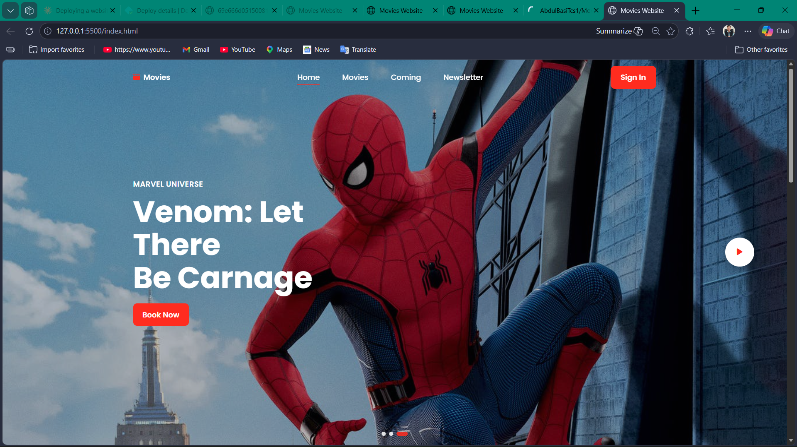
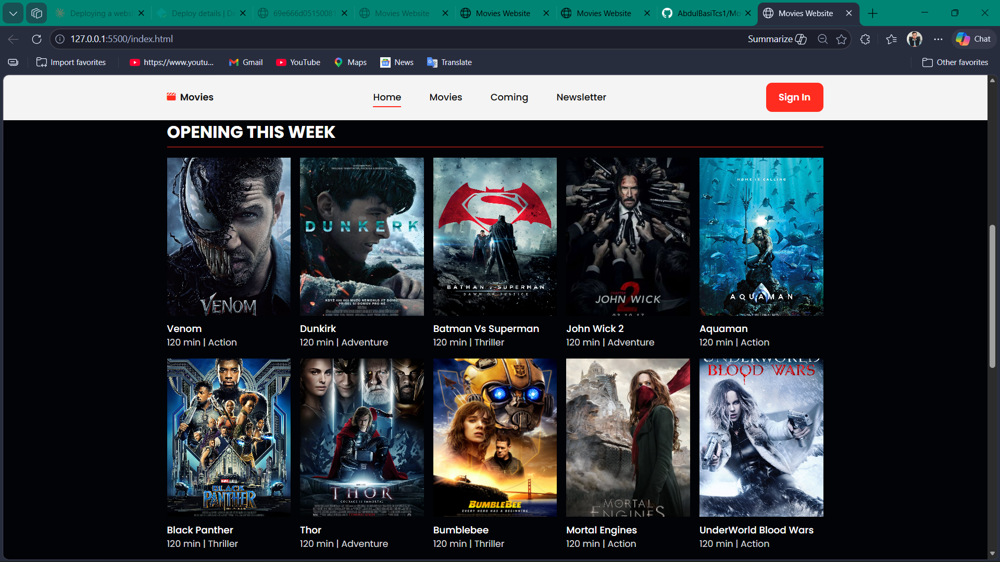
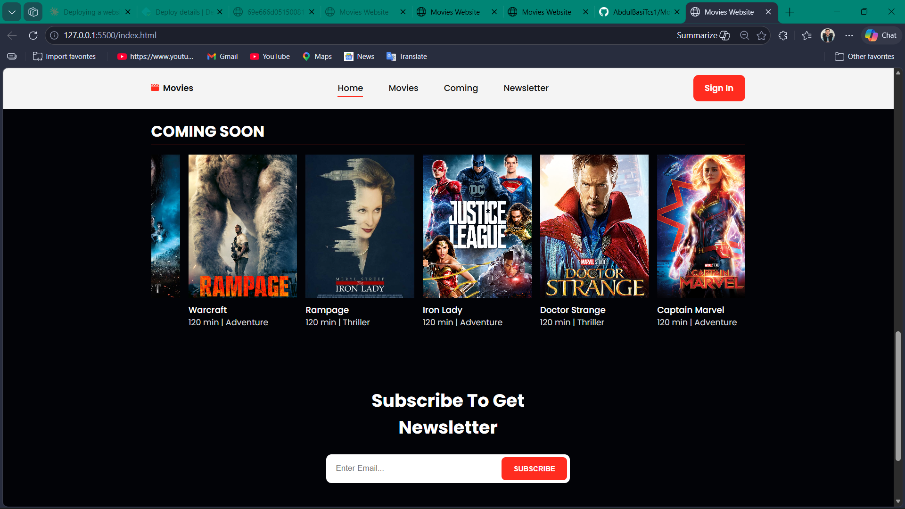
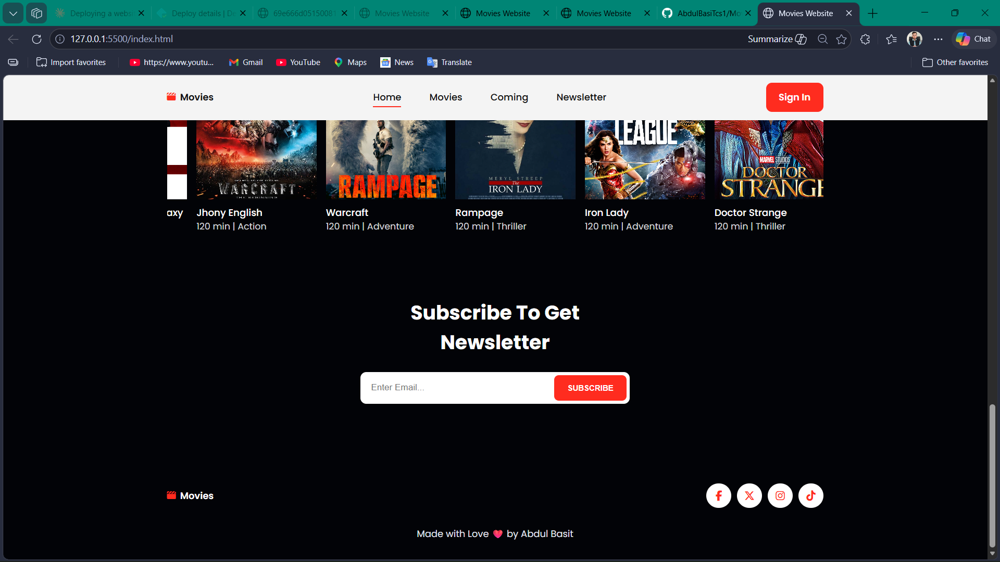

# Movies Website

A basic responsive movie landing page built with plain HTML, CSS, and JavaScript.

## Live Demo

[View Live Site](https://deft-sable-7c6ef7.netlify.app/)

## Preview

## Overview

This project is a front-end practice website that showcases:

- A hero section with autoplay image slides
- Movie cards for "Opening This Week"
- A horizontal "Coming Soon" carousel
- A newsletter subscription form with basic validation
- Responsive navigation for desktop and mobile screens

## Tech Stack

- HTML5
- CSS3
- Vanilla JavaScript (no frameworks)
- Font Awesome (CDN)
- Google Fonts - Poppins

## Project Structure

- `index.html` - page markup and sections
- `style.css` - layout, styling, and responsive breakpoints
- `script.js` - interactivity (menu toggle, slider, scrolling, form feedback)
- `img/` - image assets used by hero and movie cards

## Getting Started

Because this is a static project, no installation is required.

1. Clone or download the repository.
2. Open `index.html` directly in your browser, or use a local server.

If you are using VS Code, you can run it with the Live Server extension for faster development.

## Features

- Fixed header with style change on scroll
- Hero slider with dot navigation and autoplay
- Auto-scrolling "Coming Soon" movie strip
- Mobile-friendly navigation menu
- Newsletter form success/error feedback message

## Future Improvements

- Connect newsletter form to a real backend service
- Add movie data from an API instead of hardcoded content
- Add trailer modal/player support for the play button
- Improve accessibility labels and keyboard support

## Author

Made with care by Abdul Basit.
